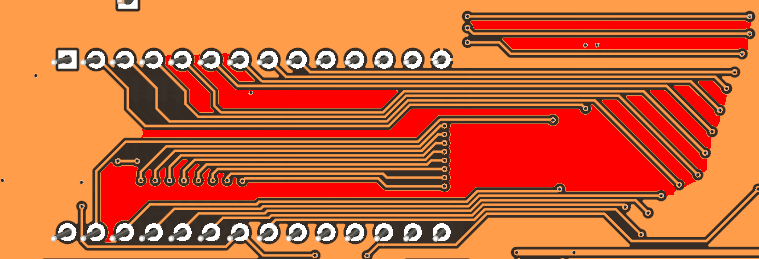
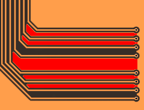
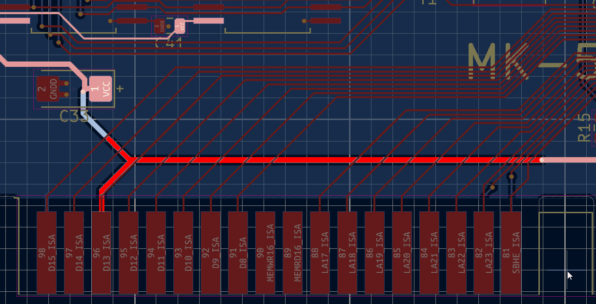
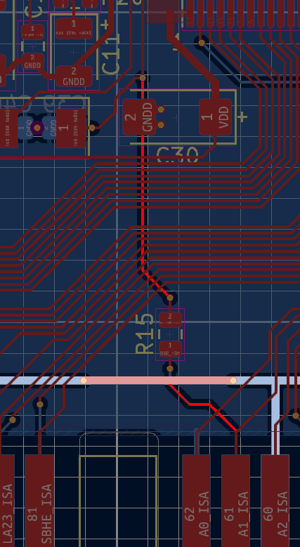
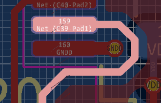
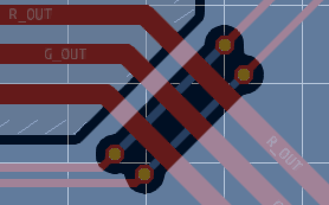
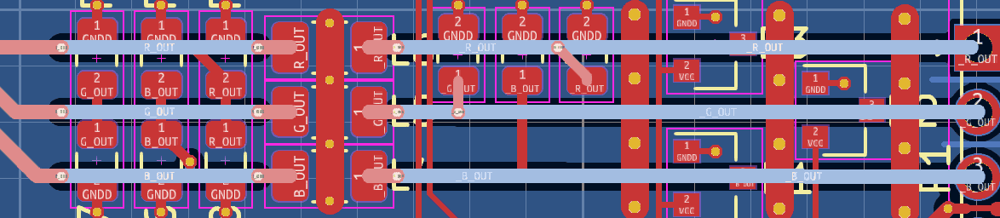
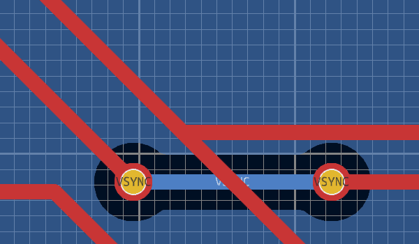
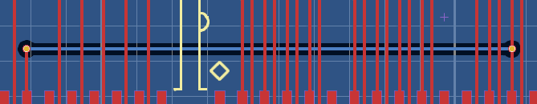

Fork of https://github.com/matt1187/542x_ISA 'Remaking from Cirrus Logic Databook "CL-GD542X_Technical_Reference_Manual_Jan1994"' attempting to show some routing optimizations.
  
# Fixes

1 Bad ground. We dont want thin long ground noodles connected to real ground by a thin sliver on one side

like between:
- PD0 PD1 PD2 PD3 PD4 PD5 PD6
- PD16 20 21 22 23
- under U5
- tiny one under U11
- long big one under extended ISA slot
- A2_ISA 3 4 5 6 7

Ground that is not solid plane or densely (<wavelenght) stitched to solid plane no longer works as ground, it works like an antenna and amplifies interference. In the past guard traces were used before we had good modeling and understanding of magnetic propagation on the pcb, they only worked because putting one forced engineers to make more space between signal traces. All those dangling traces between signal tracks just resonate amplifying interference[^1].

3 Extended ISA slot - routing VCC straight to C33 instead of going across the card wouldnt be breaking ground plane under D8-16 and LA signals.

4 Omitting ISA oscillator input option will make ground more solid. Currently it leaves a dangling track with very high frequency clock crossing D8-18 and LA lines while breaking ground even when unused. Using ISA 14MHz was a cost cutting measure saving maybe 50 cents for a crystal resonator and two capacitors in the nineties, nowadays useless.

5 Pin 159 oscillator goes in a weird around pad way making it go outside of ground plane coverage. Its especially critical to have uninterrupted ground under clock signals.

6 Afaik separate isolated analog/digital ground planes is a relic of the past, modern techniques show it doesnt work if it cuts up ground into multiple islands and forces signals to cross them[^2][^3][^4]. Here for example it paradoxically messes with analog signal integrity by making RGB Video suddenly lose reference. Im fairly certain this aspect of Cirrus recommended design only makes things worse.

7 Optional EEprom pins also degrade analog RGB Video signals by breaking ground :( best option would be routing those two tracks with jumpers over analog RGB.

8 Filtering analog VGA looks nice when symmetricaly placed in neat rows, but forces analog B crossing over analog G, and all analog tracks going under where they arent routed over ground plane. Vias high impedance is really bad for such high speed analog signals. Asymmetrical component placement might hurt OCD, but lets us leave Analog RGB on top layer over healthy uninterrupted ground.

9 H and V syncs cross each other with no ground underneath, swapping filtering sections around solves that.

10 3 amp fuse and thick tracks on Vga Pin 9 is overdoing it, especially considering Cirrus is not even capable of reading Edid. Removing altogether.

11 Very long RAS1 under U13 U14 can be avoided, makes it look stupid but ground plane is healthier = shorter cuts = shorter return paths = less interference and crosstalk.

TLDR Golden rule is every signal should run as close as possible (preferably over) a ground directly connecting source and destination of said signal with lowest impedance. Signals arent electrons, they are electromagnetic waves and need to close the loop. Closer the ground smaller the field, lower the ground impedance higher the frequency of mitigated interferences, bigger ground plane = better, traveling thru multiple vias = bad.

Some of the fixes are heavily overdoing it via stitched ground patches and are most likely also bad :) Nowadays upgrading from five PCBs with 2-layers to 4-layers of that size is $20, another $15 for 6-layer with ENIG finish, giving us infinitely healthier signal integrity and tons less routing work. Other than for fun there is very little sense manufacturing this as 2-layer design, repository is for educational purposes only.

# License
The project is free for non-commercial reproduction. Do not sell it on Ebay or other platforms for profit. Do not make a closed source derivative. Share your experiences and ideas with the community.

This work is licensed under a [Creative Commons Attribution-NonCommercial-ShareAlike 4.0 International License][cc-by-nc-sa].

[![CC BY-NC-SA 4.0][cc-by-nc-sa-image]][cc-by-nc-sa]

[cc-by-nc-sa]: http://creativecommons.org/licenses/by-nc-sa/4.0/
[cc-by-nc-sa-image]: https://licensebuttons.net/l/by-nc-sa/4.0/88x31.png

# References
[^1]: https://resources.altium.com/p/guard-traces-hit-or-myth.
[^2]: https://resources.altium.com/p/how-to-use-a-star-point-for-analog-ground-digital-ground-connection
[^3]: https://resources.pcb.cadence.com/blog/2021-should-you-ever-separate-analog-and-digital-ground-planes
[^4]: "Ground planes in a PCB layout with 30 years of experience: The ultimate guide" by Hans Rosenberg https://www.youtube.com/watch?v=EEb_0dja8tE&list=PLsWHPs7La-3KUY2JDUyrz0Jc0xw8kH4zQ
